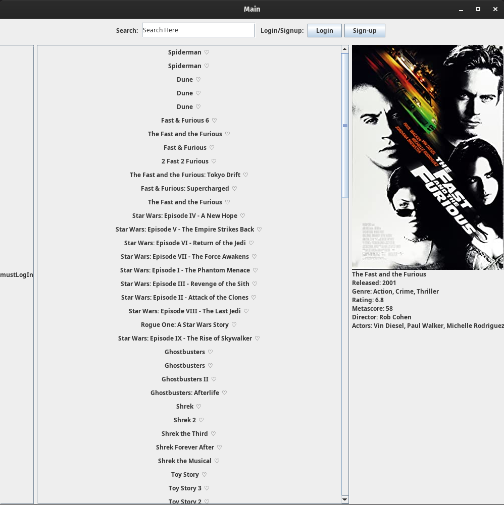
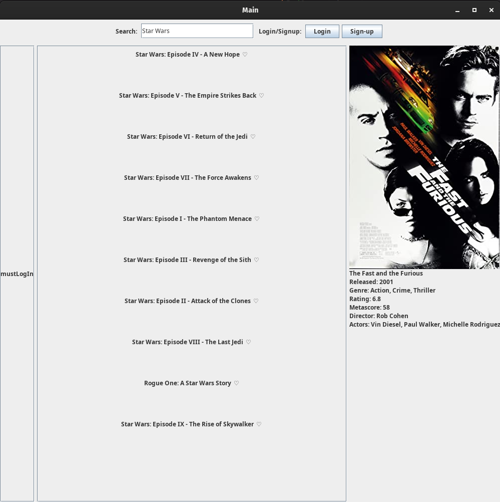
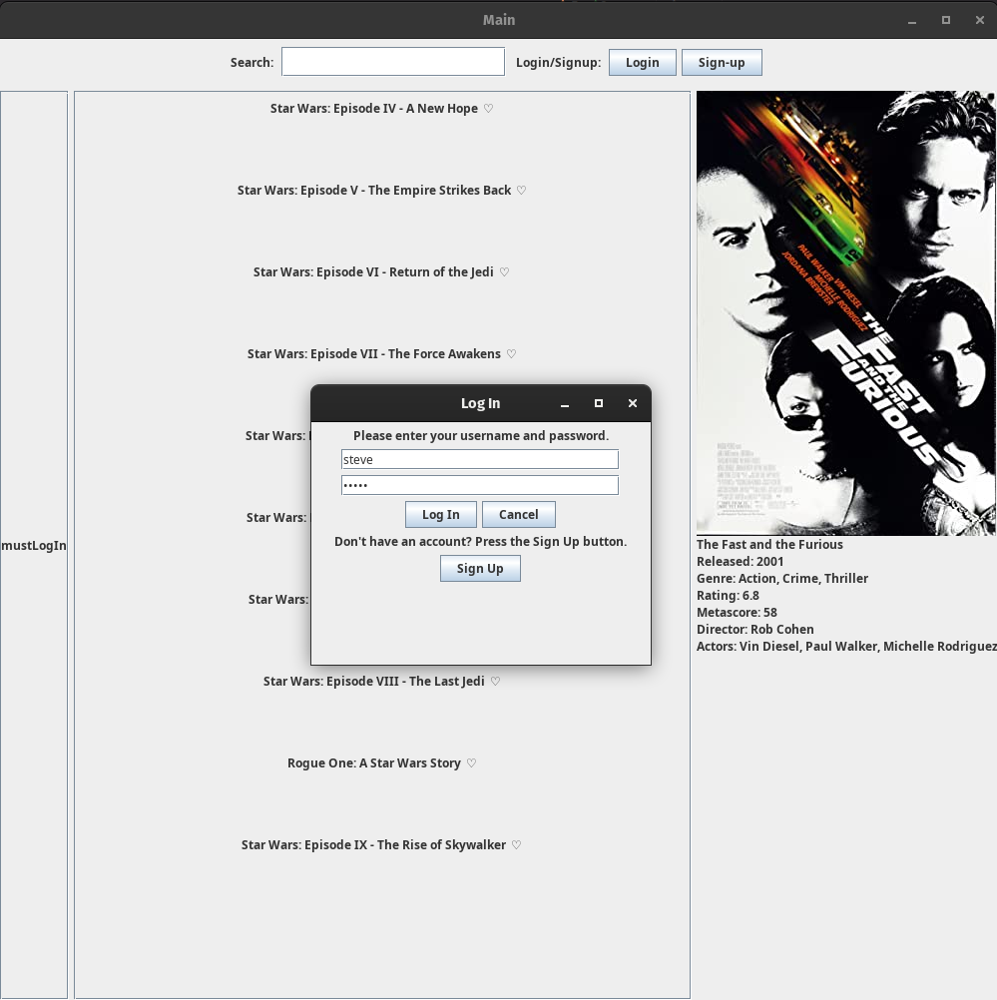
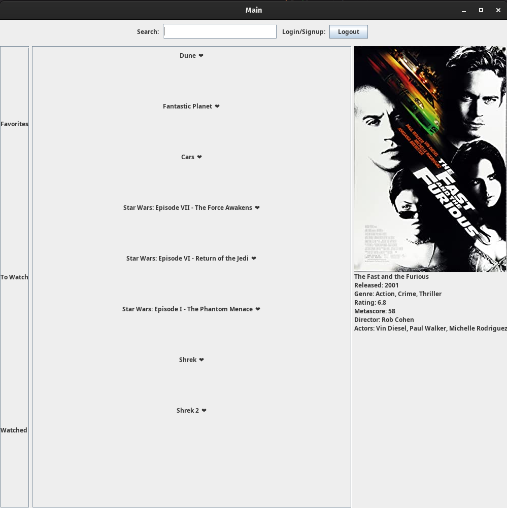

# Moive Library App for CS-321 Team 10

### Contacts

| Name | Email | Git-ID | Major |
| --- | --- | --- | --- |
| Stephen Stammen | sms0066@uah.edu | robotcorner | Computer Engineering | 
| Daniel Mills | dmm0043@uah.edu | dandeto | Computer Engineering |
| Braden Willingham | bsw0014@uah.edu | BradenW99 | Cyber Security |
| Caleb Bagwell | rcb0027@uah.edu | CalebBagwell | Computer Science |

## Task Overview

This is six week team project for creating a **Java** Swing app related to organize a list of books or movies that the user chooses.

### Summary of Actions

Please refer to the GitHub project [board](https://github.com/robotcorner/CS-321-JavaTeamProjectTeam10/projects?type=beta).

## App Details

**Title**: My Awesome Movie Library (MAML)

### Instructions for Building, Configuring, and Executing Code

**Getting the App:**

1. Download or clone the repository

**Configuring the App:**

1. Open the java project directory in your favorite IDE or Code Editor
2. Go to the configuration file in the data folder.
3. Edit it as needed to the path required or desired.

**Running the App - choose path a or b**: 

**Path a**: Open it in Intellij

1. Build Project with the build icon.
2. Right click the main.java code in the editor and select run.
3. The app will run and you can use it as desired.

**Path b**: Run via command line

1. Open the terminal to the location where you downloaded the project.
2. Type `javac main.java`
3. Type `java main`

### UML Diagrams
#### Class Outline UML - Preliminary 

#### Class Outline UML - Detailed

- This is incomplete.

## App Demonstrations for Onlookers

#### Main Page

#### Search Functionality

#### Login Prompt

#### Favorite Icons Add and Remove from Collection Automatically with Icon

